

<!-- _class: xl-text title -->
# InfoMagnus Engineering Fundamentals Playbook

---

## Playbook & Training Objectives

* **Increase Team Efficiency:** Provide clear guidelines and best practices to enhance overall efficiency for team members.
* **Reduce Mistakes and Avoid Pitfalls:** Educate team members on common mistakes and pitfalls to ensure higher quality work.
* **Promote Continuous Improvement:** Encourage engineers to continuously improve by learning from shared experiences and following the playbook.
* **Ensure Adherence to Best Practices:** Ensure all team members are familiar with and follow the engineering fundamentals outlined in the playbook.
* **Enhance Code Quality and Security:** Emphasize maintaining high code quality and implementing robust security measures throughout development.
* **Foster Effective Communication and Collaboration:** Promote effective communication within the team and with stakeholders through regular meetings, clear documentation, and feedback loops.

---

## An engineer working for an InfoMagnus project...

* Has responsibilities to their team – mentor, coach, and lead.
* Knows their **playbook**. Follows their playbook. Utilizes their playbook.
* Leads by example. Models the behaviors we desire both interpersonally and technically.
* Strives to understand how their work fits into a broader context and ensures the outcome.
 

[This is <u>OUR</u> playbook](https://github.com/im-infomagnus/ms-code-with-engineering-playbook).

---

## Where to Find the Playbook

* **GitHub Repo:**  [https://github.com/im-infomagnus/ms-code-with-engineering-playbook](https://github.com/im-infomagnus/ms-code-with-engineering-playbook)

  

## Where to Find Support
* **Microsoft Teams:** [Engineering Playbook Support](https://teams.microsoft.com/l/channel/19%3ARDetb_2o-wHYuhln_a-ccT2-AId8Ik3b3-gHD6dntp01%40thread.tacv2/Engineering%20Playbook%20Support?groupId=81760021-9c8f-4924-8c89-e789ca4b85d5&tenantId=4e31fdef-8b04-47cb-a9f6-8c0b2ad482e1&ngc=true&allowXTenantAccess=true)
---
<!-- _class: remove-border  -->

> ## A Note on This Training
> **This training does not cover all content in the Engineering Playbook.**  
> - **Everyone** is individually responsible to learn and follow the practices defined in the full playbook.
> - Any gaps or uncertainties should be reviewed with management.
> - The playbook is a **living document** — it will receive regular updates as we refine our procedures and best practices.
> - This is our **first version**. We will update it over time. Everyone is welcome to contribute.

---

## Playbook Usage Policy

* **Usage starts now:** All new projects are required to leverage the Playbook.
* **Periodic reviews:** There will be occasional reviews of projects to assess playbook adherence.
* **Mutual support:** There is a lot for everyone to learn — support each other.
* **New-hire onboarding:** The Engineering Playbook must be included in all onboarding activities for new hires.
* **Accountability:** Team Leads. Project Managers and Champions are responsible for ensuring playbook follow-through on their projects.
* **Exceptions:** Exceptions to playbook implementation may be granted on a case-by-case basis. Please be sure to document exceptions.

---

<!-- ## THERE ARE THREE CORE IMPLEMENTATION REFERENCES THAT MUST BE FOLLOWED

 

#### _ANY DEVIATION FROM THESE BUILDING BLOCKS   MUST BE DOCUMENTED_

 

1. **[Engineering Fundamentals Checklist](https://github.com/im-infomagnus/ms-code-with-engineering-playbook/blob/main/docs/engineering-fundamentals-checklist.md)**

2. **[Project Startup Checklist](https://github.com/im-infomagnus/ms-code-with-engineering-playbook/blob/main/docs/project-startup-tasks.md)**

3. **[The First Week of an InfoMagnus Project](https://github.com/im-infomagnus/ms-code-with-engineering-playbook/blob/main/docs/the-first-week-of-an-infomagnus-project.md)**

--- -->

## Tracking Implementation of Playbook Usage

**All future projects will be required to include GH Issues in a given project's repo that correlate with the Playbook items detailed in those implementation files:**

- Engineering Fundamentals Checklist
- Project Startup Checklist
- The First Week of an InfoMagnus Project
 

To import the GH Issues/tasks into a GH repo, utilize the directions below to run a GH Actions workflow.
 

**FULL DOCUMENTATION**
### &rarr; [Directions](../how-to-import-playbook-tasks-into-GH-issues/README.md)

---

## Where GH Issues/tasks should reside

- For all internal InfoMagnus projects, every repo should contain the Issues/tasks
- For projects external to InfoMagnus that are potentially based in a GH repo owned by a client, Bitbucket, Azure, (etc.), a separate distinct repo will need to be created to manage and document the Issues/tasks

**Note:**
- Any internal projects (internal to InfoMagnus) need to reside inside the GH InfoMagnus Enterprise account
  - any internal projects that potentially are based in Azure, Bitbucket (etc.) must be migrated to the GH InfoMagnus Enterprise account
  - any internal projects stored in a GH account that is outside of the GH InfoMagnus Enterprise account need to be brought to the attention of [Byron Goodman](mailto:byron.goodman@InfoMagnus.com)

---

### The result of the workflow will be an issues table or board (your team's choice) that will render similar to this:

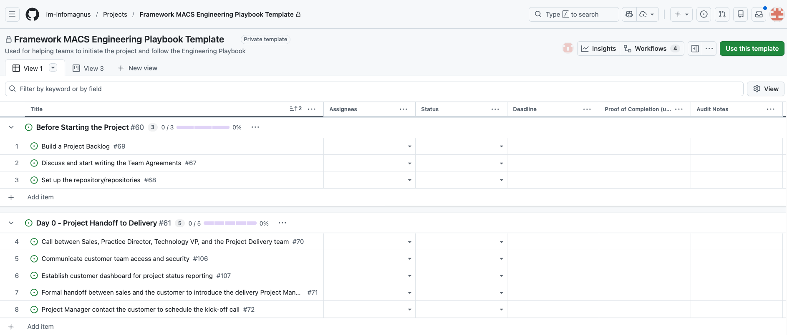

---

  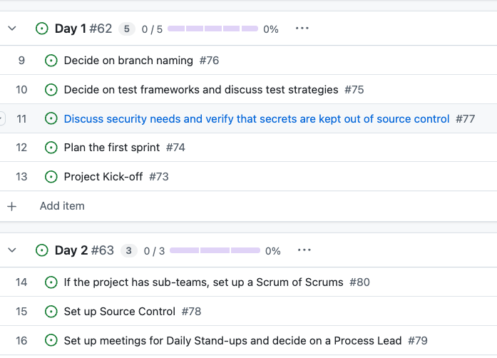
  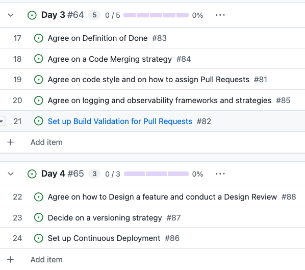
  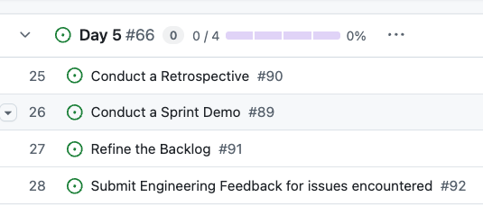

---

  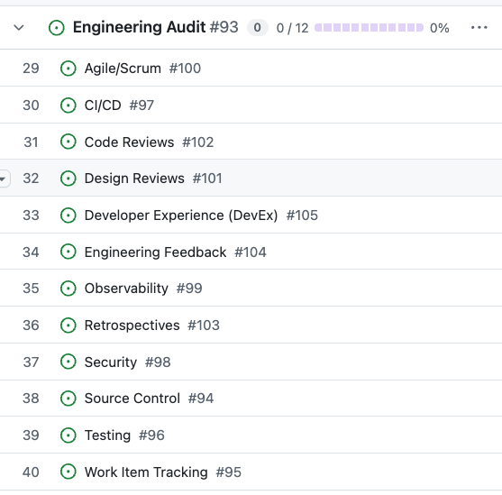
  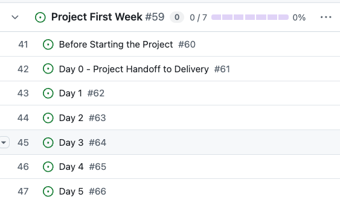
  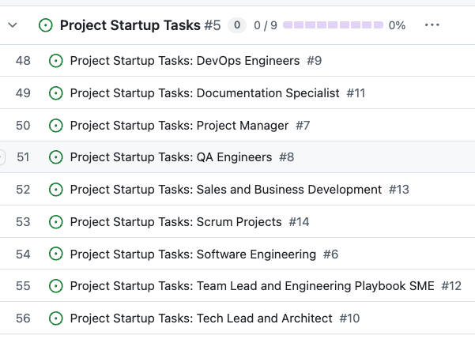

---

  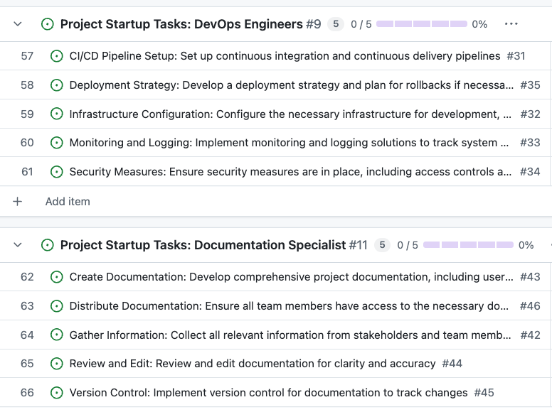
  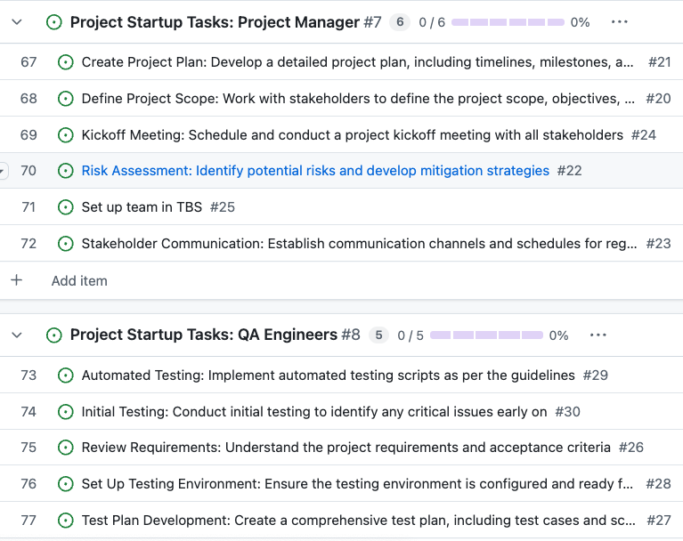

---

  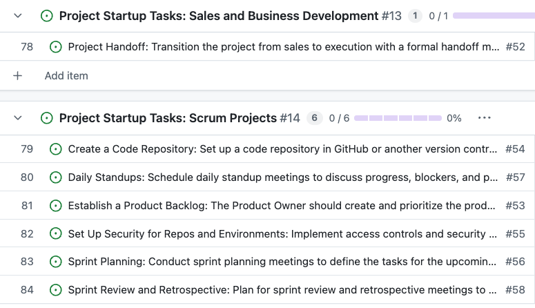
  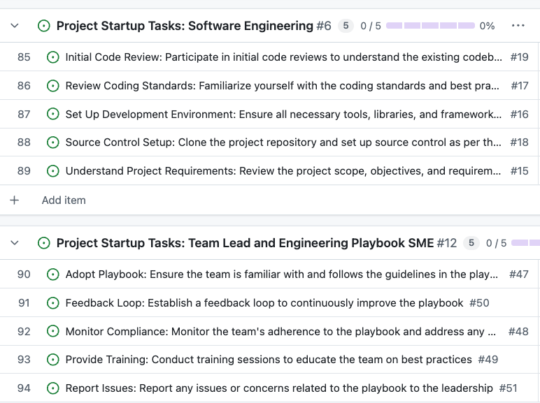

---

  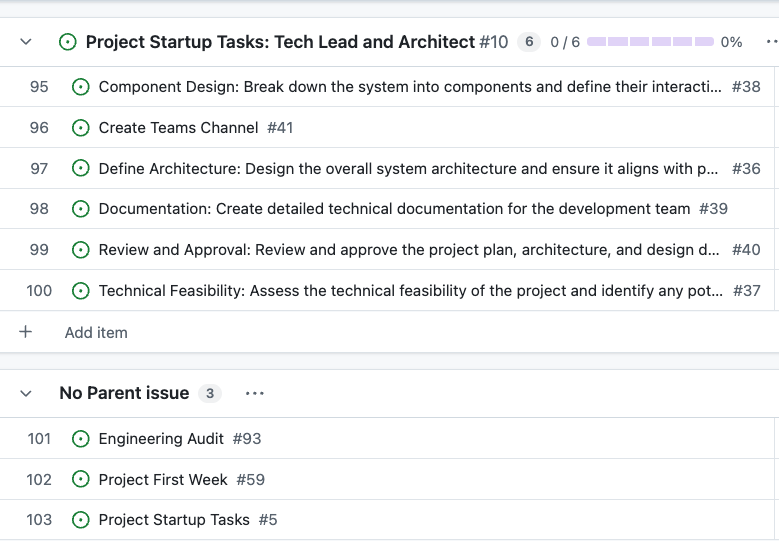

---

<!-- _class: remove-border small-text  -->

> ## General Expectations for Teams
> * Keep the code quality bar high.
> * Value quality and precision over 'getting things done'.
> * Work diligently on the one important thing.
> * As a distributed team take time to share context via wiki, teams and backlog items.
> * Make the simple thing work now. Build fewer features today, but ensure they work amazingly. Then add more features tomorrow.
> * Avoid adding scope to a backlog item, instead add a new backlog item.
> * Our goal is to ship incremental customer value.
> * Keep backlog item details up to date to communicate the state of things with the rest of your team.
> * Report product issues found and provide clear and repeatable engineering feedback!
> * We all own our code and each one of us has an obligation to make all parts of the solution great.

---
<!-- _class: large-text  -->

# Engineering Fundamentals Checklist

---
<!-- _class: large-text -->

> **This checklist helps to ensure that our projects meet our Engineering Fundamentals.**

---

<!-- _class: checklist -->

### Source Control

☐ The default target branch is locked.

☐ Merges are done through PRs.

☐ PRs reference related work items.

☐ Commit history is consistent and commit messages are informative (what, why).

☐ Consistent branch naming conventions.

☐ Clear documentation of repository structure.

☐ Secrets are not part of the commit history or made public. (see [Credential scanning](https://github.com/im-infomagnus/ms-code-with-engineering-playbook/blob/main/docs/CI-CD/dev-sec-ops/secrets-management/credential_scanning.md))

☐ Public repositories follow the [OSS guidelines](https://github.com/im-infomagnus/ms-code-with-engineering-playbook/tree/main/docs/source-control/README.md#creating-a-new-repository), see `Required files in default branch for public repositories`.
 

More details on [source control](https://github.com/im-infomagnus/ms-code-with-engineering-playbook/tree/main/docs/source-control/README.md)

---

<!-- _class: checklist -->

### Work Item Tracking

☐ All items are tracked in via GH Issues, AzDevOps (or similar).

☐ The board is organized (swim lanes, feature tags, technology tags).
 

More details on [backlog management](https://github.com/im-infomagnus/ms-code-with-engineering-playbook/tree/main/docs/agile-development/backlog-management.md)

---

### Testing

☐ Unit tests cover the majority of all components (>90% if possible).

☐ Integration tests run to test the solution e2e.
 

More details on [automated testing](https://github.com/im-infomagnus/ms-code-with-engineering-playbook/tree/main/docs/automated-testing/README.md)

---
<!-- _class: checklist -->

### CI/CD

☐ Project runs CI with automated build and test on each PR.

☐ Project uses CD to manage deployments to a replica environment before PRs are merged.

☐ Main branch is always shippable.
 

More details on [continuous integration](https://github.com/im-infomagnus/ms-code-with-engineering-playbook/tree/main/docs/CI-CD/continuous-integration.md) and [continuous delivery](https://github.com/im-infomagnus/ms-code-with-engineering-playbook/tree/main/docs/CI-CD/continuous-delivery.md)

---
<!-- _class: checklist -->

### Security

☐ Access is only granted on an as-needed basis

☐ Secrets are stored in secured locations and not checked in to code

☐ Data is encrypted in transit (and if necessary at rest) and passwords are hashed

☐ Is the system split into logical segments with separation of concerns? This helps limiting security vulnerabilities.
 

More details on [security](https://github.com/im-infomagnus/ms-code-with-engineering-playbook/tree/main/docs/security/README.md)

---

<!-- _class: checklist -->

### Observability

☐ Significant business and functional events are tracked and related metrics collected.

☐ Application faults and errors are logged.

☐ Health of the system is monitored.

☐ The client and server side observability data can be differentiated.

☐ Logging configuration can be modified without code changes (eg: verbose mode).

☐ [Incoming tracing context](https://github.com/im-infomagnus/ms-code-with-engineering-playbook/tree/main/docs/observability/correlation-id.md) is propagated to allow for production issue debugging purposes.

☐ GDPR compliance is ensured regarding PII (Personally Identifiable Information).
 

More details on [observability](https://github.com/im-infomagnus/ms-code-with-engineering-playbook/tree/main/docs/observability/README.md)

---

<!-- _class: checklist -->

### Agile/Scrum

☐ Process Lead (fixed/rotating) runs the daily standup

☐ The agile process is clearly defined within team.

☐ The Dev Lead (+ PO/Others) are responsible for backlog management and refinement.

☐ A working agreement is established between team members and customer.
 

More details on [agile development](https://github.com/im-infomagnus/ms-code-with-engineering-playbook/tree/main/docs/agile-development/README.md)

---

<!-- _class: checklist small-text -->

### Design Reviews

☐ Process for conducting design reviews is included in the [Working Agreement](https://github.com/im-infomagnus/ms-code-with-engineering-playbook/tree/main/docs/agile-development/team-agreements/working-agreement.md).

☐ Design reviews for each major component of the solution are carried out and documented, including alternatives.

☐ Stories and/or PRs link to the design document.

☐ Each user story includes a task for design review by default, which is assigned or removed during sprint planning.

☐ Project advisors are invited to design reviews or asked to give feedback to the design decisions captured in documentation.

☐ Discover all the reviews that the customer's processes require and plan for them.

☐ Clear non-functional requirements captured &nbsp;&nbsp;&nbsp;&nbsp;(see [Non-Functional Requirements Guidance](https://github.com/im-infomagnus/ms-code-with-engineering-playbook/blob/main/docs/design/design-patterns/non-functional-requirements-capture-guide.md))

☐ Risks and opportunities captured (see [Risk/Opportunity Management](https://github.com/im-infomagnus/ms-code-with-engineering-playbook/tree/main/docs/agile-development/advanced-topics/backlog-management/risk-management.md))
 

More details on [design reviews](https://github.com/im-infomagnus/ms-code-with-engineering-playbook/tree/main/docs/design/design-reviews/README.md)

---

<!-- _class: checklist -->

### Code Reviews

☐ There is a clear agreement in the team as to function of code reviews.

☐ The team has a code review checklist or established process.

☐ A minimum number of reviewers (usually 2) for a PR merge is enforced by policy.

☐ Linters/Code Analyzers, unit tests and successful builds for PR merges are set up.

☐ There is a process to enforce a quick review turnaround.
 

More details on [code reviews](https://github.com/im-infomagnus/ms-code-with-engineering-playbook/tree/main/docs/code-reviews/README.md)

---

<!-- _class: checklist -->

### Retrospectives

☐ Retrospectives are conducted each week/at the end of each sprint.

☐ The team identifies 1-3 proposed experiments to try each week/sprint to improve the process.

☐ Experiments have owners and are added to project backlog.

☐ The team conducts longer retrospective for Milestones and project completion.
 

More details on [retrospectives](https://github.com/im-infomagnus/ms-code-with-engineering-playbook/tree/main/docs/agile-development/ceremonies.md#retrospectives)

---
<!-- _class: checklist-->

### Engineering Feedback

☐ The team submits feedback on business and technical blockers that prevent project success

☐ Suggestions for improvements are incorporated in the solution

☐ Feedback is detailed and repeatable
 

More details on [engineering feedback](https://github.com/im-infomagnus/ms-code-with-engineering-playbook/tree/main/docs/engineering-feedback/README.md)

---
<!-- _class: checklist-->

### Developer Experience (DevEx)

☐ Build/Compile source to verify it is free of syntax errors and compiles.

☐ Execute all automated tests (unit, e2e, etc).

☐ Start/Launch end-to-end to simulate execution in a deployed environment.

☐ Attach a debugger to started solution or running automated tests, set breakpoints, step through code, and inspect variables.

☐ Automatically install dependencies by pressing F5 (or equivalent) in their IDE.

☐ Use local dev configuration values (i.e. .env, appsettings.development.json).
 

More details on [developer experience](https://github.com/im-infomagnus/ms-code-with-engineering-playbook/tree/main/docs/developer-experience/README.md)

---
<!-- _class: xl-text  -->

# The First Week of an InfoMagnus Project

---
<!-- _class: large-text  -->

> **The purpose of this document is to:**
> - Organize content in the playbook for quick reference and discoverability
> - Provide content in a logical structure which reflects the engineering process
> - Extensible hierarchy to allow teams to share deep subject-matter expertise
> - Layout tasks that each team is responsible for when starting a project - from inception through its first week

---
<!-- _class: small-text checklist-->

## Before Starting the Project

☐ Discuss and start writing the Team Agreements. Update these documents with any process decisions made throughout the project
  - [Working Agreement](https://github.com/im-infomagnus/ms-code-with-engineering-playbook/tree/main/docs/agile-development/team-agreements/working-agreement.md)
  - [Definition of Ready](https://github.com/im-infomagnus/ms-code-with-engineering-playbook/tree/main/docs/agile-development/team-agreements/definition-of-ready.md)
  - [Definition of Done](https://github.com/im-infomagnus/ms-code-with-engineering-playbook/tree/main/docs/agile-development/team-agreements/definition-of-done.md)
  - [Estimation](https://github.com/im-infomagnus/ms-code-with-engineering-playbook/tree/main/docs/agile-development/ceremonies.md#estimation)
 

☐ [Set up the repository/repositories](https://github.com/im-infomagnus/ms-code-with-engineering-playbook/tree/main/docs/source-control/README.md#creating-a-new-repository)
  - Decide on repository structure/s
  - Add README.md, LICENSE, CONTRIBUTING.md, .gitignore, etc.
 

☐ [Build a Product Backlog](https://github.com/im-infomagnus/ms-code-with-engineering-playbook/tree/main/docs/agile-development/advanced-topics/backlog-management)
  - Set up a project in your chosen project management tool (ex. Azure DevOps)
  - [INVEST](https://en.wikipedia.org/wiki/INVEST_(mnemonic)) in good User Stories and Acceptance Criteria
  - [Non-Functional Requirements Guidance](https://github.com/im-infomagnus/ms-code-with-engineering-playbook/tree/main/docs/design/design-patterns/non-functional-requirements-capture-guide.md)
     

---  

> ### Day 0 - Project Handoff to Delivery
- Call between Sales, Practice Director, Technology VP, and the Project Delivery team to:
  - Review the customer need and objectives
  - Discuss the project and the key deliverables and tasks that have been agreed to
  - Discuss the customer - what are the big picture objectives with the customer following the engagement? What key things does the delivery team need to know to be successful (key contacts, issues, points of focus, etc.)?
- Confirmation from Sales the customer is ready to engage
- Formal handoff between sales and the customer to introduce the delivery Project Manager
- Project Manager should then reach out to the customer to get the kick-off call scheduled.

---

<!-- _class: checklist -->

> ### Day 1

- Project Kick-off
  - Call with customer scheduled by the Project Manager to review
      - Project
      - Goals
      - Objectives
      - Team
      - Establish communication pathways, weekly status meetings, coordinate
      - Request access / permissions to systems as needed
---      

☐ [Plan the first sprint](https://github.com/im-infomagnus/ms-code-with-engineering-playbook/tree/main/docs/agile-development/ceremonies.md#sprint-planning)
  - Agree on a sprint goal, and how to measure the sprint progress
  - Determine team capacity
  - Assign user stories to the sprint and split user stories into tasks
  - Set up Work in Progress (WIP) limits
 

☐ [Decide on test frameworks and discuss test strategies](https://github.com/im-infomagnus/ms-code-with-engineering-playbook/tree/main/docs/automated-testing/README.md)
  - Discuss the purpose and goals of tests and how to measure test coverage
  - Agree on how to separate unit tests from integration, load and smoke tests
  - Design the first test cases
 

☐ [Decide on branch naming](https://github.com/im-infomagnus/ms-code-with-engineering-playbook/tree/main/docs/source-control/naming-branches.md)
 

☐ [Discuss security needs and verify that secrets are kept out of source control](https://github.com/im-infomagnus/ms-code-with-engineering-playbook/tree/main/docs/CI-CD/dev-sec-ops/secrets-management/README.md)

---

<!-- _class: checklist -->

> ### Day 2

☐ [Set up Source Control](https://github.com/im-infomagnus/ms-code-with-engineering-playbook/tree/main/docs/source-control/README.md)
  - Agree on [best practices for commits](https://github.com/im-infomagnus/ms-code-with-engineering-playbook/tree/main/docs/source-control/git-guidance/README.md#commit-best-practices)
   

☐ [Set up basic Continuous Integration with linters and automated tests](https://github.com/im-infomagnus/ms-code-with-engineering-playbook/tree/main/docs/CI-CD/continuous-integration.md)
   
  
☐ [Set up meetings for Daily Stand-ups and decide on a Process Lead](https://github.com/im-infomagnus/ms-code-with-engineering-playbook/tree/main/docs/agile-development/ceremonies.md#stand-up)
  - Discuss purpose, goals, participants and facilitation guidance
  - Discuss timing, and how to run an efficient stand-up
 

☐ [If the project has sub-teams, set up a Scrum of Scrums](https://github.com/im-infomagnus/ms-code-with-engineering-playbook/tree/main/docs/agile-development/advanced-topics/effective-organization/scrum-of-scrums.md)

---

<!-- _class: checklist -->

> ### Day 3

☐ [Agree on code style](https://github.com/im-infomagnus/ms-code-with-engineering-playbook/tree/main/docs/code-reviews/README.md) and on [how to assign Pull Requests](https://github.com/im-infomagnus/ms-code-with-engineering-playbook/tree/main/docs/code-reviews/pull-requests.md)
 

☐ [Set up Build Validation for Pull Requests (2 reviewers, linters, automated tests)](https://github.com/im-infomagnus/ms-code-with-engineering-playbook/tree/main/docs/code-reviews/README.md) and agree on [Definition of Done](https://github.com/im-infomagnus/ms-code-with-engineering-playbook/tree/main/docs/agile-development/team-agreements/definition-of-done.md)
 

☐ [Agree on a Code Merging strategy](https://github.com/im-infomagnus/ms-code-with-engineering-playbook/tree/main/docs/source-control/merge-strategies.md) and update the CONTRIBUTING.md
 

☐ [Agree on logging and observability frameworks and strategies](https://github.com/im-infomagnus/ms-code-with-engineering-playbook/tree/main/docs/observability/README.md)

---

<!-- _class: checklist -->

> ### Day 4

☐ [Set up Continuous Deployment](https://github.com/im-infomagnus/ms-code-with-engineering-playbook/tree/main/docs/CI-CD/continuous-delivery.md)
  - Determine what environments are appropriate for this solution
  - For each environment discuss purpose, when deployment should trigger, pre-deployment approvers, sign-off for promotion.
 

☐ [Decide on a versioning strategy](https://github.com/im-infomagnus/ms-code-with-engineering-playbook/tree/main/docs/source-control/component-versioning.md)
 

☐ Agree on how to [Design a feature and conduct a Design Review](https://github.com/im-infomagnus/ms-code-with-engineering-playbook/tree/main/docs/design/design-reviews/README.md)

---

<!-- _class: checklist -->

> ### Day 5

☐ Conduct a [Sprint Demo](https://github.com/im-infomagnus/ms-code-with-engineering-playbook/tree/main/docs/agile-development/ceremonies.md#sprint-demo)
 

☐ Conduct a [Retrospective](https://github.com/im-infomagnus/ms-code-with-engineering-playbook/tree/main/docs/agile-development/ceremonies.md#retrospectives)
  - Determine required participants, how to capture input (tools) and outcome
  - Set a timeline, and discuss facilitation, meeting structure etc.
 

☐ [Refine the Backlog](https://github.com/im-infomagnus/ms-code-with-engineering-playbook/tree/main/docs/agile-development/advanced-topics/backlog-management)
  - Determine required participants
  - Update the [Definition of Ready](https://github.com/im-infomagnus/ms-code-with-engineering-playbook/tree/main/docs/agile-development/team-agreements/definition-of-ready.md)
  - Update estimates, and the [Estimation](https://github.com/im-infomagnus/ms-code-with-engineering-playbook/tree/main/docs/agile-development/ceremonies.md#estimation) document
 

☐ [Submit Engineering Feedback for issues encountered](https://github.com/im-infomagnus/ms-code-with-engineering-playbook/tree/main/docs/engineering-feedback/README.md)

---
<!-- _class: xl-text  -->

# Project Startup Tasks

---
<!-- _class: large-text  -->

> **This contains a set of tasks that each role is responsible for to initiate a project. If a task is not required for a specific project, have the team agree to bypass that task.**

---

<!-- _class: checklist -->

### Software Engineers

☐ Understand Project Requirements: Review the project scope, objectives, and requirements provided by the Technical Lead and Project Manager.

☐ Set Up Development Environment: Ensure all necessary tools, libraries, and frameworks are installed and configured.

☐ Review Coding Standards: Familiarize yourself with the coding standards and best practices outlined in the playbook.

☐ Source Control Setup: Clone the project repository and set up source control as per the guidelines.

☐ Initial Code Review: Participate in initial code reviews to understand the existing codebase and identify areas for improvement.

---

<!-- _class: checklist -->

### Project Managers
☐ Define Project Scope: Work with stakeholders to define the project scope, objectives, and deliverables.

☐ Create Project Plan: Develop a detailed project plan, including timelines, milestones, and resource allocation.

☐ Risk Assessment: Identify potential risks and develop mitigation strategies.

☐ Stakeholder Communication: Establish communication channels and schedules for regular updates.

☐ Kickoff Meeting: Schedule and conduct a project kickoff meeting with all stakeholders.

---

<!-- _class: checklist -->

### Quality Assurance Engineers
☐ Review Requirements: Understand the project requirements and acceptance criteria.

☐ Test Plan Development: Create a comprehensive test plan, including test cases and scenarios.

☐ Set Up Testing Environment: Ensure the testing environment is configured and ready for use.

☐ Automated Testing: Implement automated testing scripts as per the guidelines.

☐ Initial Testing: Conduct initial testing to identify any critical issues early on.

---

<!-- _class: checklist -->

### DevOps Engineers
☐ CI/CD Pipeline Setup: Set up continuous integration and continuous delivery pipelines.

☐ Infrastructure Configuration: Configure the necessary infrastructure for development, testing, and production environments.

☐ Monitoring and Logging: Implement monitoring and logging solutions to track system performance and issues.

☐ Security Measures: Ensure security measures are in place, including access controls and vulnerability scanning.

☐ Deployment Strategy: Develop a deployment strategy and plan for rollbacks if necessary.

---

<!-- _class: checklist -->

### Technical Leads and Architects
☐ Define Architecture: Design the overall system architecture and ensure it aligns with project requirements.

☐ Technical Feasibility: Assess the technical feasibility of the project and identify any potential challenges.

☐ Component Design: Break down the system into components and define their interactions.

☐ Documentation: Create detailed technical documentation for the development team.

☐ Review and Approval: Review and approve the project plan, architecture, and design documents.

☐ Create Teams Channel

---

<!-- _class: checklist -->

### Documentation Specialists
☐ Gather Information: Collect all relevant information from stakeholders and team members.

☐ Create Documentation: Develop comprehensive project documentation, including user guides, technical manuals, and FAQs.

☐ Review and Edit: Review and edit documentation for clarity and accuracy.

☐ Version Control: Implement version control for documentation to track changes.

☐ Distribute Documentation: Ensure all team members have access to the necessary documentation.

---

<!-- _class: checklist -->

### Team Leads and Playbook Champions
☐ Adopt Playbook: Ensure the team is familiar with and follows the guidelines in the playbook.

☐ Monitor Compliance: Monitor the team's adherence to the playbook and address any deviations.

☐ Provide Training: Conduct training sessions to educate the team on best practices.

☐ Feedback Loop: Establish a feedback loop to continuously improve the playbook.

☐ Report Issues: Report any issues or concerns related to the playbook to the leadership.

---

<!-- _class: checklist -->

### Sales and Business Development
☐ Lead Qualification: Identify and qualify potential leads for the project.

☐ Discovery Session: Conduct discovery sessions to understand customer needs and requirements.

☐ Proposal Development: Develop a tailored proposal outlining the project scope, deliverables, and pricing.

☐ Contract Negotiation: Negotiate and finalize the contract with the customer.

☐ Project Handoff: Transition the project from sales to execution with a formal handoff meeting.

---

<!-- _class: checklist -->

### Additional Tasks for Scrum Projects
☐ Establish a Product Backlog: The Product Owner should create and prioritize the product backlog, detailing all features, enhancements, and bug fixes.

☐ Create a Code Repository: Set up a code repository in GitHub or another version control system to manage the project's source code.

☐ Set Up Security for Repos and Environments: Implement access controls and security measures to protect the code repository and development environments.

☐ Sprint Planning: Conduct sprint planning meetings to define the tasks for the upcoming sprint and assign them to team members.

☐ Daily Standups: Schedule daily standup meetings to discuss progress, blockers, and plans for the day.

☐ Sprint Review and Retrospective: Plan for sprint review and retrospective meetings to evaluate the sprint's outcomes and identify areas for improvement.

---

## Summary

- The Engineering Playbook is our shared foundation for delivering quality software at InfoMagnus.
- Three core references — the Engineering Fundamentals Checklist, Project Startup Tasks, and The First Week guide — are non-negotiable starting points for every project.
- Team Leads and Project Managers are accountable for playbook adoption on their projects.
- Every team member is responsible for knowing the full playbook — not just this training.
- This is a living document. Contribute, improve, and share it.

 

---
<!-- _class: xl-text  -->

# QUESTIONS?

---

<!-- _class: med-text  -->

### To address future questions:

Review with your manager, or visit the playbook directly:
[https://github.com/im-infomagnus/ms-code-with-engineering-playbook](https://github.com/im-infomagnus/ms-code-with-engineering-playbook)

 

**_MS Teams Channel_**: Engineering Excellence | Engineering Playbook

---

## Contributing

Demonstrating Engineering Fundamentals is core to what we do at InfoMagnus and is one of the primary values we bring to our customers, helping them to level up while collaborating on their business scenarios.

The purpose of this playbook is to provide guidance to InfoMagnus software engineers and data scientists (together forming a Dev Crew) with regards to engineering fundamentals. It describes recommended practices based on continuous project learnings in different areas. It can be used as a tool at the beginning of an engagement that can be shared with customers to help set the project up for success. This playbook is *not* intended as a code repo, instead it provides guidance and links to appropriate sample code repos that represent good examples.

**_*This project welcomes contributions and suggestions._**

---

## What to contribute

- Patterns and practices that have worked well in engagements, related to our engineering fundamentals
- Content that can be publicly visible (avoid confidential information)
- Content that is generally applicable (avoid references to internal processes, or very specific information)
- Short code snippets or links to OSS repos (avoid large code assets)

If you are unsure if your content will match this playbook, you are welcome to contact one of the _Engineering Fundamentals Champs_ to discuss the contribution.

---

## General guidance on contributing

- Quality is more important than quantity
- Write in a way that you would want someone else to explain something to you. Use `plain english`
- Be friendly, technical, professional and concise
- Communicate as engineers, not marketing; we want to share what we learned, not "sell" our ideas
- Don't recreate introductory content, link to it
- Add context around patterns, recipes etc. so that the reader understands when and where a pattern may be applicable and where it may not
- Think about how readers can discover your content, is it easy to find?

---
<!-- _class: med-text  -->

We welcome maintenance of the repository and contributions that:

- Makes the content more readable
- Makes the content more discoverable
- Fixes content that has gone out-of-date

 
...or anything that improves the quality of the playbook

---

<!-- ## Running Locally (*Remotely*)

TBD -->
